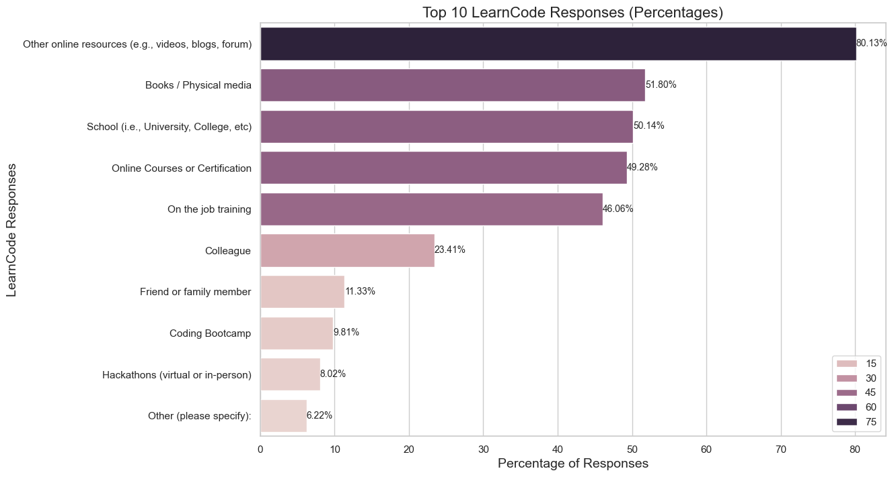

# Exploratory Data Analysis - Stack Overflow Developer Survey 

Exploratory Data Analysis (EDA) is the process of exploring, investigating and gathering insights from data using statistical measures and visualizations. The objective of EDA is to develop and understanding of data, by uncovering trends, relationships and patterns. 

EDA is both a science and an art. On the one hand it requires the knowledge of statistics, visualization techniques and data analysis tools like Numpy, Pandas, Seaborn etc. On the other hand, it requires asking interesting questions to guide the investigation and interpreting numbers & figures to generate useful insights.


## Introduction

In this notebook, we'll analyze the StackOverflow Developer Survey 2020 dataset. The dataset contains responses to an annual survey conducted by StackOverflow. You can find the official analysis of the data here: https://insights.stackoverflow.com/survey.


```python
import pandas as pd
import numpy as np
import matplotlib.pyplot as plt
import seaborn as sns
import plotly.express as px
import textwrap
import folium
from folium import plugins
%matplotlib inline
```

### Read the csv file


```python
survey_raw_df = pd.read_csv('survey_results_public.csv')
survey_raw_df.columns
```


    Index(['ResponseId', 'Q120', 'MainBranch', 'Age', 'Employment', 'RemoteWork',
           'CodingActivities', 'EdLevel', 'LearnCode', 'LearnCodeOnline',
           'LearnCodeCoursesCert', 'YearsCode', 'YearsCodePro', 'DevType',
           'OrgSize', 'PurchaseInfluence', 'TechList', 'BuyNewTool', 'Country',
           'Currency', 'CompTotal', 'LanguageHaveWorkedWith',
           'LanguageWantToWorkWith', 'DatabaseHaveWorkedWith',
           'DatabaseWantToWorkWith', 'PlatformHaveWorkedWith',
           'PlatformWantToWorkWith', 'WebframeHaveWorkedWith',
           'WebframeWantToWorkWith', 'MiscTechHaveWorkedWith',
           'MiscTechWantToWorkWith', 'ToolsTechHaveWorkedWith',
           'ToolsTechWantToWorkWith', 'NEWCollabToolsHaveWorkedWith',
           'NEWCollabToolsWantToWorkWith', 'OpSysPersonal use',
           'OpSysProfessional use', 'OfficeStackAsyncHaveWorkedWith',
           'OfficeStackAsyncWantToWorkWith', 'OfficeStackSyncHaveWorkedWith',
           'OfficeStackSyncWantToWorkWith', 'AISearchHaveWorkedWith',
           'AISearchWantToWorkWith', 'AIDevHaveWorkedWith', 'AIDevWantToWorkWith',
           'NEWSOSites', 'SOVisitFreq', 'SOAccount', 'SOPartFreq', 'SOComm',
           'SOAI', 'AISelect', 'AISent', 'AIAcc', 'AIBen',
           'AIToolInterested in Using', 'AIToolCurrently Using',
           'AIToolNot interested in Using', 'AINextVery different',
           'AINextNeither different nor similar', 'AINextSomewhat similar',
           'AINextVery similar', 'AINextSomewhat different', 'TBranch', 'ICorPM',
           'WorkExp', 'Knowledge_1', 'Knowledge_2', 'Knowledge_3', 'Knowledge_4',
           'Knowledge_5', 'Knowledge_6', 'Knowledge_7', 'Knowledge_8',
           'Frequency_1', 'Frequency_2', 'Frequency_3', 'TimeSearching',
           'TimeAnswering', 'ProfessionalTech', 'Industry', 'SurveyLength',
           'SurveyEase', 'ConvertedCompYearly'],
          dtype='object')


```python
survey_raw_df.head()
```


<div>
<table border="1" class="dataframe">
  <thead>
    <tr style="text-align: right;">
      <th></th>
      <th>ResponseId</th>
      <th>Q120</th>
      <th>MainBranch</th>
      <th>Age</th>
      <th>Employment</th>
      <th>RemoteWork</th>
      <th>CodingActivities</th>
      <th>EdLevel</th>
      <th>LearnCode</th>
      <th>LearnCodeOnline</th>
      <th>...</th>
      <th>Frequency_1</th>
      <th>Frequency_2</th>
      <th>Frequency_3</th>
      <th>TimeSearching</th>
      <th>TimeAnswering</th>
      <th>ProfessionalTech</th>
      <th>Industry</th>
      <th>SurveyLength</th>
      <th>SurveyEase</th>
      <th>ConvertedCompYearly</th>
    </tr>
  </thead>
  <tbody>
    <tr>
      <th>0</th>
      <td>1</td>
      <td>I agree</td>
      <td>None of these</td>
      <td>18-24 years old</td>
      <td>NaN</td>
      <td>NaN</td>
      <td>NaN</td>
      <td>NaN</td>
      <td>NaN</td>
      <td>NaN</td>
      <td>...</td>
      <td>NaN</td>
      <td>NaN</td>
      <td>NaN</td>
      <td>NaN</td>
      <td>NaN</td>
      <td>NaN</td>
      <td>NaN</td>
      <td>NaN</td>
      <td>NaN</td>
      <td>NaN</td>
    </tr>
    <tr>
      <th>1</th>
      <td>2</td>
      <td>I agree</td>
      <td>I am a developer by profession</td>
      <td>25-34 years old</td>
      <td>Employed, full-time</td>
      <td>Remote</td>
      <td>Hobby;Contribute to open-source projects;Boots...</td>
      <td>Bachelor’s degree (B.A., B.S., B.Eng., etc.)</td>
      <td>Books / Physical media;Colleague;Friend or fam...</td>
      <td>Formal documentation provided by the owner of ...</td>
      <td>...</td>
      <td>1-2 times a week</td>
      <td>10+ times a week</td>
      <td>Never</td>
      <td>15-30 minutes a day</td>
      <td>15-30 minutes a day</td>
      <td>DevOps function;Microservices;Automated testin...</td>
      <td>Information Services, IT, Software Development...</td>
      <td>Appropriate in length</td>
      <td>Easy</td>
      <td>285000.0</td>
    </tr>
    <tr>
      <th>2</th>
      <td>3</td>
      <td>I agree</td>
      <td>I am a developer by profession</td>
      <td>45-54 years old</td>
      <td>Employed, full-time</td>
      <td>Hybrid (some remote, some in-person)</td>
      <td>Hobby;Professional development or self-paced l...</td>
      <td>Bachelor’s degree (B.A., B.S., B.Eng., etc.)</td>
      <td>Books / Physical media;Colleague;On the job tr...</td>
      <td>Formal documentation provided by the owner of ...</td>
      <td>...</td>
      <td>6-10 times a week</td>
      <td>6-10 times a week</td>
      <td>3-5 times a week</td>
      <td>30-60 minutes a day</td>
      <td>30-60 minutes a day</td>
      <td>DevOps function;Microservices;Automated testin...</td>
      <td>Information Services, IT, Software Development...</td>
      <td>Appropriate in length</td>
      <td>Easy</td>
      <td>250000.0</td>
    </tr>
    <tr>
      <th>3</th>
      <td>4</td>
      <td>I agree</td>
      <td>I am a developer by profession</td>
      <td>25-34 years old</td>
      <td>Employed, full-time</td>
      <td>Hybrid (some remote, some in-person)</td>
      <td>Hobby</td>
      <td>Bachelor’s degree (B.A., B.S., B.Eng., etc.)</td>
      <td>Colleague;Friend or family member;Other online...</td>
      <td>Formal documentation provided by the owner of ...</td>
      <td>...</td>
      <td>1-2 times a week</td>
      <td>10+ times a week</td>
      <td>1-2 times a week</td>
      <td>15-30 minutes a day</td>
      <td>30-60 minutes a day</td>
      <td>Automated testing;Continuous integration (CI) ...</td>
      <td>NaN</td>
      <td>Appropriate in length</td>
      <td>Easy</td>
      <td>156000.0</td>
    </tr>
    <tr>
      <th>4</th>
      <td>5</td>
      <td>I agree</td>
      <td>I am a developer by profession</td>
      <td>25-34 years old</td>
      <td>Employed, full-time;Independent contractor, fr...</td>
      <td>Remote</td>
      <td>Hobby;Contribute to open-source projects;Profe...</td>
      <td>Bachelor’s degree (B.A., B.S., B.Eng., etc.)</td>
      <td>Books / Physical media;Online Courses or Certi...</td>
      <td>Formal documentation provided by the owner of ...</td>
      <td>...</td>
      <td>1-2 times a week</td>
      <td>1-2 times a week</td>
      <td>3-5 times a week</td>
      <td>60-120 minutes a day</td>
      <td>30-60 minutes a day</td>
      <td>Microservices;Automated testing;Observability ...</td>
      <td>Other</td>
      <td>Appropriate in length</td>
      <td>Neither easy nor difficult</td>
      <td>23456.0</td>
    </tr>
  </tbody>
</table>
<p>5 rows × 84 columns</p>
</div>


```python
survey_raw_df.describe()
```


<div>
<table border="1" class="dataframe">
  <thead>
    <tr style="text-align: right;">
      <th></th>
      <th>ResponseId</th>
      <th>CompTotal</th>
      <th>WorkExp</th>
      <th>ConvertedCompYearly</th>
    </tr>
  </thead>
  <tbody>
    <tr>
      <th>count</th>
      <td>89184.000000</td>
      <td>4.822500e+04</td>
      <td>43579.000000</td>
      <td>4.801900e+04</td>
    </tr>
    <tr>
      <th>mean</th>
      <td>44592.500000</td>
      <td>1.036807e+42</td>
      <td>11.405126</td>
      <td>1.031101e+05</td>
    </tr>
    <tr>
      <th>std</th>
      <td>25745.347541</td>
      <td>2.276847e+44</td>
      <td>9.051989</td>
      <td>6.814188e+05</td>
    </tr>
    <tr>
      <th>min</th>
      <td>1.000000</td>
      <td>0.000000e+00</td>
      <td>0.000000</td>
      <td>1.000000e+00</td>
    </tr>
    <tr>
      <th>25%</th>
      <td>22296.750000</td>
      <td>6.300000e+04</td>
      <td>5.000000</td>
      <td>4.390700e+04</td>
    </tr>
    <tr>
      <th>50%</th>
      <td>44592.500000</td>
      <td>1.150000e+05</td>
      <td>9.000000</td>
      <td>7.496300e+04</td>
    </tr>
    <tr>
      <th>75%</th>
      <td>66888.250000</td>
      <td>2.300000e+05</td>
      <td>16.000000</td>
      <td>1.216410e+05</td>
    </tr>
    <tr>
      <th>max</th>
      <td>89184.000000</td>
      <td>5.000000e+46</td>
      <td>50.000000</td>
      <td>7.435143e+07</td>
    </tr>
  </tbody>
</table>
</div>


### Reading the schema file to a Data Frame


```python
schema_df_raw = pd.read_csv('survey_results_schema.csv')

schema_df = schema_df_raw[['qname','question']]
schema_df = schema_df.set_index('qname')
schema_df.index = schema_df.index.astype(str)
schema_df_raw.info()

```

    <class 'pandas.core.frame.DataFrame'>
    RangeIndex: 78 entries, 0 to 77
    Data columns (total 6 columns):
     #   Column      Non-Null Count  Dtype 
    ---  ------      --------------  ----- 
     0   qid         78 non-null     object
     1   qname       78 non-null     object
     2   question    78 non-null     object
     3   force_resp  67 non-null     object
     4   type        78 non-null     object
     5   selector    78 non-null     object
    dtypes: object(6)
    memory usage: 3.8+ KB
    


```python
questions_df =schema_df_raw[['qname','question']]
questions_df
```


<div>
<table border="1" class="dataframe">
  <thead>
    <tr style="text-align: right;">
      <th></th>
      <th>qname</th>
      <th>question</th>
    </tr>
  </thead>
  <tbody>
    <tr>
      <th>0</th>
      <td>S0</td>
      <td>&lt;div&gt;&lt;span style="font-size:19px;"&gt;&lt;strong&gt;Hel...</td>
    </tr>
    <tr>
      <th>1</th>
      <td>MetaInfo</td>
      <td>Browser Meta Info</td>
    </tr>
    <tr>
      <th>2</th>
      <td>Q310</td>
      <td>&lt;div&gt;&lt;span style="font-size:19px;"&gt;&lt;strong&gt;You...</td>
    </tr>
    <tr>
      <th>3</th>
      <td>Q120</td>
      <td></td>
    </tr>
    <tr>
      <th>4</th>
      <td>S1</td>
      <td>&lt;span style="font-size:22px; font-family: aria...</td>
    </tr>
    <tr>
      <th>...</th>
      <td>...</td>
      <td>...</td>
    </tr>
    <tr>
      <th>73</th>
      <td>Knowledge_7</td>
      <td>Waiting on answers to questions often causes i...</td>
    </tr>
    <tr>
      <th>74</th>
      <td>Knowledge_8</td>
      <td>I feel like I have the tools and/or resources ...</td>
    </tr>
    <tr>
      <th>75</th>
      <td>Frequency_1</td>
      <td>Needing help from people outside of your immed...</td>
    </tr>
    <tr>
      <th>76</th>
      <td>Frequency_2</td>
      <td>Interacting with people outside of your immedi...</td>
    </tr>
    <tr>
      <th>77</th>
      <td>Frequency_3</td>
      <td>Encountering knowledge silos (where one indivi...</td>
    </tr>
  </tbody>
</table>
<p>78 rows × 2 columns</p>
</div>


```python
questions_df[questions_df['qname']=='MiscTech']

```


<div>

<table border="1" class="dataframe">
  <thead>
    <tr style="text-align: right;">
      <th></th>
      <th>qname</th>
      <th>question</th>
    </tr>
  </thead>
  <tbody>
    <tr>
      <th>30</th>
      <td>MiscTech</td>
      <td>Which &lt;b&gt;other frameworks and libraries&lt;/b&gt; ha...</td>
    </tr>
  </tbody>
</table>
</div>


```python
mask = schema_df.index.str.contains('S[0-7]',case=False)
filtered_df = schema_df[~mask]
filtered_df
```


<div>
<table border="1" class="dataframe">
  <thead>
    <tr style="text-align: right;">
      <th></th>
      <th>question</th>
    </tr>
    <tr>
      <th>qname</th>
      <th></th>
    </tr>
  </thead>
  <tbody>
    <tr>
      <th>MetaInfo</th>
      <td>Browser Meta Info</td>
    </tr>
    <tr>
      <th>Q310</th>
      <td>&lt;div&gt;&lt;span style="font-size:19px;"&gt;&lt;strong&gt;You...</td>
    </tr>
    <tr>
      <th>Q120</th>
      <td></td>
    </tr>
    <tr>
      <th>MainBranch</th>
      <td>Which of the following options best describes ...</td>
    </tr>
    <tr>
      <th>Age</th>
      <td>What is your age? *</td>
    </tr>
    <tr>
      <th>...</th>
      <td>...</td>
    </tr>
    <tr>
      <th>Knowledge_7</th>
      <td>Waiting on answers to questions often causes i...</td>
    </tr>
    <tr>
      <th>Knowledge_8</th>
      <td>I feel like I have the tools and/or resources ...</td>
    </tr>
    <tr>
      <th>Frequency_1</th>
      <td>Needing help from people outside of your immed...</td>
    </tr>
    <tr>
      <th>Frequency_2</th>
      <td>Interacting with people outside of your immedi...</td>
    </tr>
    <tr>
      <th>Frequency_3</th>
      <td>Encountering knowledge silos (where one indivi...</td>
    </tr>
  </tbody>
</table>
<p>70 rows × 1 columns</p>
</div>


```python
survey_raw_df.Age.unique()
```


    array(['18-24 years old', '25-34 years old', '45-54 years old',
           '35-44 years old', 'Under 18 years old', '55-64 years old',
           '65 years or older', 'Prefer not to say'], dtype=object)


```python
age_counts = survey_raw_df.Age.value_counts().reset_index(name='Count')
age_counts
```


<div>
<table border="1" class="dataframe">
  <thead>
    <tr style="text-align: right;">
      <th></th>
      <th>Age</th>
      <th>Count</th>
    </tr>
  </thead>
  <tbody>
    <tr>
      <th>0</th>
      <td>25-34 years old</td>
      <td>33247</td>
    </tr>
    <tr>
      <th>1</th>
      <td>35-44 years old</td>
      <td>20532</td>
    </tr>
    <tr>
      <th>2</th>
      <td>18-24 years old</td>
      <td>17931</td>
    </tr>
    <tr>
      <th>3</th>
      <td>45-54 years old</td>
      <td>8334</td>
    </tr>
    <tr>
      <th>4</th>
      <td>Under 18 years old</td>
      <td>4128</td>
    </tr>
    <tr>
      <th>5</th>
      <td>55-64 years old</td>
      <td>3392</td>
    </tr>
    <tr>
      <th>6</th>
      <td>65 years or older</td>
      <td>1171</td>
    </tr>
    <tr>
      <th>7</th>
      <td>Prefer not to say</td>
      <td>449</td>
    </tr>
  </tbody>
</table>
</div>


```python
age_sectors = {}
for age_group, count in zip(age_counts['Age'], age_counts['Count']):
    # Extract rows for the current age group
    age_sector_df = survey_raw_df[survey_raw_df['Age'] == age_group]
    
    # Store the age sector DataFrame in the dictionary
    age_sectors[age_group] = age_sector_df
    
age_18_24_df = age_sectors.get('18-24 years old',pd.DataFrame())


age_18_24_df.shape
```


    (17931, 84)


## Grouping the responses with the age group
#### What is your age? *


```python
plt.figure(figsize=(10, 6))
plt.barh(age_counts['Age'], age_counts['Count'])
plt.title('Distribution of Responses by Age Group')
plt.xlabel('Age Group')
plt.ylabel('Count of Responses')
# plt.xticks(rotation=75)
plt.show()
```


    

    


## Number of responses per country
### The top 10 countries with the most responses

#### Where do you live? 


```python
questions_df[questions_df['qname']=='Country']
```


<div>
<table border="1" class="dataframe">
  <thead>
    <tr style="text-align: right;">
      <th></th>
      <th>qname</th>
      <th>question</th>
    </tr>
  </thead>
  <tbody>
    <tr>
      <th>22</th>
      <td>Country</td>
      <td>Where do you live? &lt;span style="font-weight: b...</td>
    </tr>
  </tbody>
</table>
</div>


```python
top_countries_submissions = survey_raw_df.Country.value_counts().head(10)
top_countries_submissions
```


    Country
    United States of America                                18647
    Germany                                                  7328
    India                                                    5625
    United Kingdom of Great Britain and Northern Ireland     5552
    Canada                                                   3507
    France                                                   2933
    Poland                                                   2435
    Netherlands                                              2383
    Australia                                                2078
    Brazil                                                   2042
    Name: count, dtype: int64


```python
country_counts = survey_raw_df['Country'].value_counts().reset_index(name='Submissions')
country_counts
head_country_counts = country_counts.head(15)
country_counts

```


<div>

<table border="1" class="dataframe">
  <thead>
    <tr style="text-align: right;">
      <th></th>
      <th>Country</th>
      <th>Submissions</th>
    </tr>
  </thead>
  <tbody>
    <tr>
      <th>0</th>
      <td>United States of America</td>
      <td>18647</td>
    </tr>
    <tr>
      <th>1</th>
      <td>Germany</td>
      <td>7328</td>
    </tr>
    <tr>
      <th>2</th>
      <td>India</td>
      <td>5625</td>
    </tr>
    <tr>
      <th>3</th>
      <td>United Kingdom of Great Britain and Northern I...</td>
      <td>5552</td>
    </tr>
    <tr>
      <th>4</th>
      <td>Canada</td>
      <td>3507</td>
    </tr>
    <tr>
      <th>...</th>
      <td>...</td>
      <td>...</td>
    </tr>
    <tr>
      <th>180</th>
      <td>Saint Kitts and Nevis</td>
      <td>1</td>
    </tr>
    <tr>
      <th>181</th>
      <td>Marshall Islands</td>
      <td>1</td>
    </tr>
    <tr>
      <th>182</th>
      <td>Samoa</td>
      <td>1</td>
    </tr>
    <tr>
      <th>183</th>
      <td>Central African Republic</td>
      <td>1</td>
    </tr>
    <tr>
      <th>184</th>
      <td>San Marino</td>
      <td>1</td>
    </tr>
  </tbody>
</table>
<p>185 rows × 2 columns</p>
</div>


```python

sns.barplot(x='Submissions',y='Country',data=head_country_counts);
plt.xticks(rotation=75,ha='right');

```


    

    


```python
fig = px.pie(head_country_counts,values='Submissions',names='Country',title='Country Submissions',template='plotly_dark')
fig.show()

```


```python
sns.set(style="whitegrid")

# Create a horizontal bar plot
plt.figure(figsize=(18, 10))
ax = sns.barplot(x='Submissions', y='Country', data=head_country_counts, hue='Submissions')

# Display both the number and percentage at the end of each bar
total_submissions = head_country_counts['Submissions'].sum()

for index, row in head_country_counts.iterrows():
    count = row['Submissions']
    percentage = f'{100 * count / total_submissions:.1f}%'
    x = count + 0.2
    y = index
    ax.text(x, y, f'{count} ({percentage})', ha='left', va='center', fontsize=14, color='black')

# Set plot title
plt.title('Top 10 Countries by Submissions', fontsize=20)

# Show the plot
plt.show()
```


    

    


# Using Folium and the countries.geo.json plotting the countries
### plotting the submissions per country by the color coded interactive plot of the world


```python
country_counts.info()
```

    <class 'pandas.core.frame.DataFrame'>
    RangeIndex: 185 entries, 0 to 184
    Data columns (total 2 columns):
     #   Column       Non-Null Count  Dtype 
    ---  ------       --------------  ----- 
     0   Country      185 non-null    object
     1   Submissions  185 non-null    int64 
    dtypes: int64(1), object(1)
    memory usage: 3.0+ KB
    


```python
countries_geojson = 'https://raw.githubusercontent.com/johan/world.geo.json/master/countries.geo.json'
```


```python

country_counts = survey_raw_df.Country.value_counts()
country_counts_df = pd.DataFrame({ 'Country': country_counts.index, 'Count': country_counts.values})
country_counts_df.at[3, 'Country'] = 'United Kingdom'
country_counts_df.at[12, 'Country'] = 'Russia'

country_counts_df.describe()
```


<div>
<table border="1" class="dataframe">
  <thead>
    <tr style="text-align: right;">
      <th></th>
      <th>Count</th>
    </tr>
  </thead>
  <tbody>
    <tr>
      <th>count</th>
      <td>185.000000</td>
    </tr>
    <tr>
      <th>mean</th>
      <td>475.529730</td>
    </tr>
    <tr>
      <th>std</th>
      <td>1632.132807</td>
    </tr>
    <tr>
      <th>min</th>
      <td>1.000000</td>
    </tr>
    <tr>
      <th>25%</th>
      <td>9.000000</td>
    </tr>
    <tr>
      <th>50%</th>
      <td>53.000000</td>
    </tr>
    <tr>
      <th>75%</th>
      <td>317.000000</td>
    </tr>
    <tr>
      <th>max</th>
      <td>18647.000000</td>
    </tr>
  </tbody>
</table>
</div>


```python
m = folium.Map(location=[30, 0], zoom_start=2)

folium.Choropleth(
    geo_data=countries_geojson,
    data=country_counts_df,
    columns=["Country", "Count"],
    key_on="feature.properties.name",
    # threshold_scale=[1,10,50,100,500,1_000,5_000,10_000,15_000,20_000],
    fill_color="OrRd",
    fill_opacity=0.7,
    line_opacity=0.2,
    legend_name="Respondents",
).add_to(m)
# the thershold scale is used to color the countries based on the scale ranges given the data has
# to be in that range if it doesnt fit into the range then the map doesnt work
# it is better to let the folium to automatically determine the bin edges on the range of your actual data
m
```


## Educational Attainment
#### Majority of the developers have attained a Bachelor's Degree and the quarter of them having the Master's degree


```python
filtered_df = survey_raw_df.EdLevel.dropna()
filtered_df
```


    1             Bachelor’s degree (B.A., B.S., B.Eng., etc.)
    2             Bachelor’s degree (B.A., B.S., B.Eng., etc.)
    3             Bachelor’s degree (B.A., B.S., B.Eng., etc.)
    4             Bachelor’s degree (B.A., B.S., B.Eng., etc.)
    5        Some college/university study without earning ...
                                   ...                        
    89179                  Associate degree (A.A., A.S., etc.)
    89180         Bachelor’s degree (B.A., B.S., B.Eng., etc.)
    89181                                       Something else
    89182    Secondary school (e.g. American high school, G...
    89183         Bachelor’s degree (B.A., B.S., B.Eng., etc.)
    Name: EdLevel, Length: 87973, dtype: object


```python

filtered_df = survey_raw_df.dropna(subset=['EdLevel'])
edlevel_counts = filtered_df['EdLevel'].value_counts()
edlevel_labels = edlevel_counts.index.astype(str)
wrapped_labels = [textwrap.fill(label, width=20) for label in edlevel_labels]

# Plot the data using Seaborn
plt.figure(figsize=(12, 6))
ax = sns.barplot(x=edlevel_counts.values, y=wrapped_labels, hue=edlevel_labels)

# Set labels and title
plt.xlabel('Number of Responses')
plt.ylabel('Education Level')  # Empty string for y-axis label
plt.title('Number of Responses based on Education Level (Excluding NaN)')

# Hide numeric tick labels on the y-axis
plt.yticks([])

for index,value in enumerate(edlevel_counts.values):
    ax.text(value,index,f'{value}',ha='left',va='center',fontsize=10)

plt.show()

```


    

    


```python
percentage_values = (edlevel_counts / len(filtered_df)) * 100
edlevel_labels = edlevel_counts.index.astype(str)
# wrapped_labels = [textwrap.fill(label, width=20) for label in edlevel_labels]

# Plot the data using Seaborn
plt.figure(figsize=(12, 6))
ax = sns.barplot(x=edlevel_counts.values, y=wrapped_labels, hue=edlevel_labels, palette='viridis', dodge=False)

# Set labels and title
plt.xlabel('Percentage of Responses')
plt.ylabel('Education Level')  # Empty string for y-axis label
plt.title('Percentage of Responses based on Education Level (Excluding NaN)')

# Hide numeric tick labels on the y-axis
plt.yticks([])

for index, value in enumerate(percentage_values.values):
    ax.text(value, index, f'{value:.2f}%', ha='left', va='center', fontsize=10)

plt.show()

```


    

    


# Learning to code
### There are as many ways to learn to code as there are coders. Developers use a variety of tools and resources to build their skills.
### Majority of the people learn to code from free resources other online resources for example: videos, blogs, forum


```python
learn_code_data = survey_raw_df['LearnCode']

# Split the values in the column if users have selected multiple options
learn_code_data = learn_code_data.str.split(';').explode()

# Count the occurrences of each response
learn_code_counts = learn_code_data.value_counts().head(10)

# Set Seaborn style
sns.set(style="whitegrid")

# Plot the top ten responses using Seaborn
plt.figure(figsize=(12, 8))
ax = sns.barplot(x=learn_code_counts.values, y=learn_code_counts.index,palette='viridis', hue=learn_code_counts.values)
ax.set_title('Top 10 LearnCode Responses', fontsize=16)
ax.set_xlabel('LearnCode Responses', fontsize=14)
ax.set_ylabel('Number of Responses', fontsize=14)
# ax.tick_params(axis='x', rotation=75, ha='right', labelsize=12)
# ax.tick_params(axis='y', labelsize=12)

# Display the count on top of each bar
# for p in ax.patches:
#     ax.annotate(f'{p.get_height()}', (p.get_x() + p.get_width() / 2., p.get_height()),
#                 ha='center', va='baseline', fontsize=10, color='black', xytext=(0, 5),
#                 textcoords='offset points')
# plt.xticks(rotation=75
for index,value in enumerate(learn_code_counts.values):
    ax.text(value,index,f'{value}',ha='left',va='center',fontsize=10)
plt.show()
```


    

    


```python
learn_code_data = survey_raw_df['LearnCode']

learn_code_data = learn_code_data.dropna().str.split(';').explode()

top_10_learn_code_data = learn_code_data.value_counts().head(10)

total_learncode_responses = survey_raw_df.LearnCode.dropna()
total_responses = len(total_learncode_responses)
learn_code_percentages = (top_10_learn_code_data / total_responses) * 100

sns.set(style="whitegrid")

plt.figure(figsize=(12, 8))
ax = sns.barplot(x=learn_code_percentages.values, y=learn_code_percentages.index, hue=learn_code_percentages.values)
ax.set_title('Top 10 LearnCode Responses (Percentages)', fontsize=16)
ax.set_xlabel('Percentage of Responses', fontsize=14)
ax.set_ylabel('LearnCode Responses', fontsize=14)
# sns.color_palette('rocket',as_cmap=True)
# Display the percentage on top of each bar
for index, value in enumerate(learn_code_percentages.values):
    ax.text(value, index, f'{value:.2f}%', ha='left', va='center', fontsize=10)

plt.show()

```


    

    


# Exeperience
### The majority of developers are in their early to mid career stage
### Almost 50% developers have been coding for around the 10 years mark


```python
years_code_data = survey_raw_df.YearsCode.dropna()
top_10_years_code_data = years_code_data.value_counts()

```


```python
survey_raw_df['YearsCode'] = survey_raw_df['YearsCode'].replace({"Less than 1 year": 0.5, "More than 50 years": 52})

# Drop NaN values from the 'YearsCode' column
survey_raw_df = survey_raw_df[survey_raw_df['YearsCode'].notna()];

```


```python
survey_raw_df.loc[:, 'YearsCode'] = pd.to_numeric(survey_raw_df['YearsCode'], errors='coerce')

# Create age groups
bins = [0, 1, 5, 10, 15, 20, 25, 30, 35, 40, 45, 50, float('inf')]
labels = ['Less than 1 year', '1-4 years', '5-9 years', '10-14 years', '15-19 years', '20-24 years', '25-29 years', '30-34 years', '35-39 years', '40-44 years', '45-50 years', 'Greater than 50 years']

# Group by 'AgeGroup' and sum the counts for each group
grouped_data = survey_raw_df.loc[:, 'AgeGroup'] = pd.cut(survey_raw_df['YearsCode'], bins=bins, labels=labels, right=False).value_counts().reindex(labels, fill_value=0)

# Plot the results with annotations
plt.figure(figsize=(12, 6))
ax = grouped_data.plot.barh()

# Annotate each bar with the number of responses
for index, value in enumerate(grouped_data):
    ax.text(value, index, str(value), ha='left', va='center', fontsize=10)

plt.xlabel('Number of Respondents')
plt.ylabel('Years of Coding')
plt.title('Distribution of Years of Coding Experience')
plt.show()
```


    

    


```python
survey_raw_df.loc[:, 'YearsCode'] = pd.to_numeric(survey_raw_df['YearsCode'], errors='coerce')

# Create age groups
bins = [0, 1, 5, 10, 15, 20, 25, 30, 35, 40, 45, 50, float('inf')]
labels = ['Less than 1 year', '1-4 years', '5-9 years', '10-14 years', '15-19 years', '20-24 years', '25-29 years', '30-34 years', '35-39 years', '40-44 years', '45-50 years', 'Greater than 50 years']

# Group by 'AgeGroup' and calculate the percentage for each group
grouped_data = survey_raw_df.loc[:, 'AgeGroup'] = pd.cut(survey_raw_df['YearsCode'], bins=bins, labels=labels, right=False).value_counts(normalize=True).reindex(labels, fill_value=0) * 100

# Plot the results with annotations
plt.figure(figsize=(12, 6))
ax = grouped_data.plot.barh()

# Annotate each bar with the percentage
for index, value in enumerate(grouped_data):
    ax.text(value, index, f'{value:.2f}%', ha='left', va='center', fontsize=10)

plt.xlabel('Percentage of Respondents')
plt.ylabel('Years of Coding')
plt.title('Distribution of Years of Coding Experience')
plt.show()
```


    

    


# Developer Roles
#### Few developers consider themselves to be a single developer type and instead showcase a diversity of skills


## Developer Type
#### Full stack, Back-end, Front-end and desktop/enterprise app developers continue to account for the majority of all respondents.


```python
job_roles = survey_raw_df['DevType']

# Create labels for the job roles
role_labels = job_roles.value_counts().index

# Set Seaborn style
sns.set(style="whitegrid")

# Plot the results with annotations for both percentages and counts
plt.figure(figsize=(20,18))
ax = job_roles.value_counts(normalize=True).reindex(role_labels, fill_value=0).sort_values().plot.barh(color=sns.color_palette('magma', len(role_labels)))

# Annotate each bar with the percentage
for index, (percent, count) in enumerate(zip(job_roles.value_counts(normalize=True).reindex(role_labels, fill_value=0).sort_values(), job_roles.value_counts().reindex(role_labels, fill_value=0).sort_values())):
    ax.text(percent, index, f'{percent*100:.2f}% ({count})', ha='left', va='center', fontsize=12)

plt.xlabel('Percentage of Respondents',fontsize=20)
plt.ylabel('Job Roles')
plt.title('Distribution of Job Roles')

# Display a legend


plt.show()
```


    

    


# Most Popular Technologies
#### This year, the popular technologies across three different groups
- Language
- Database
- Cloud Platform

## Programming, Scripting, and Markup languages
#### Professional developers top three technologies are Javascript, HTML/CSS and SQL


```python
languages_list = survey_raw_df['LanguageHaveWorkedWith'].str.split(';')

# Flatten the list of lists into a single list
all_languages = [lang for sublist in languages_list.dropna() for lang in sublist]

# Create a DataFrame with the counts of each language
language_counts = pd.Series(all_languages).value_counts().reset_index()
language_counts.columns = ['Language', 'Count']

# Calculate the percentage of responses for each language
language_counts['Percentage'] = (language_counts['Count'] / len(languages_list.dropna())) * 100

# Sort the DataFrame by percentage
language_counts = language_counts.sort_values(by='Percentage', ascending=False)

# Set Seaborn style
sns.set(style="whitegrid")

# Plot the results
plt.figure(figsize=(12, 30))
ax = sns.barplot(x='Percentage', y='Language', data=language_counts, hue='Percentage',legend=False)

# Display the percentage values at the end of each bar
for index, (percentage, count) in enumerate(zip(language_counts['Percentage'], language_counts['Count'])):
    ax.text(percentage, index, f'{percentage:.2f}% ({count})', ha='left', va='center', fontsize=10)

# Set plot title
plt.title('Most Popular Programming Languages Used by Respondents', fontsize=16)

# Show the plot
plt.show();

```


    

    


## Learning to Code
#### Javascript as it is the language of the web is the language that developers want to learn
#### Most of the student developers use python
#### There is a growing trend to use Typescript over Javascript because of its type safety


```python
languages_list = survey_raw_df['LanguageWantToWorkWith'].str.split(';')

# Flatten the list of lists into a single list
all_languages = [lang for sublist in languages_list.dropna() for lang in sublist]

# Create a DataFrame with the counts of each language
language_counts = pd.Series(all_languages).value_counts().reset_index()
language_counts.columns = ['Language', 'Count']

# Calculate the percentage of responses for each language
language_counts['Percentage'] = (language_counts['Count'] / len(languages_list.dropna())) * 100

# Sort the DataFrame by percentage
language_counts = language_counts.sort_values(by='Percentage', ascending=False)

# Set Seaborn style
sns.set(style="whitegrid")

# Plot the results
plt.figure(figsize=(12, 30))
ax = sns.barplot(x='Percentage', y='Language', data=language_counts, hue='Percentage',legend=False)

# Display the percentage values at the end of each bar
for index, (percentage, count) in enumerate(zip(language_counts['Percentage'], language_counts['Count'])):
    ax.text(percentage, index, f'{percentage:.2f}% ({count})', ha='left', va='center', fontsize=10)

# Set plot title
plt.title('Most Popular Programming Languages Respondents want to Learn', fontsize=16)

# Show the plot
plt.show();

```


    

    


# Databases
#### PostreSQL is the most used database with MySQL in the second place 
#### PostgreSQL is mostly used in the professional work space. MySQL is the most used database for the developers who are trying to learn for the first time


```python
survey_raw_df.columns
```


    Index(['ResponseId', 'Q120', 'MainBranch', 'Age', 'Employment', 'RemoteWork',
           'CodingActivities', 'EdLevel', 'LearnCode', 'LearnCodeOnline',
           'LearnCodeCoursesCert', 'YearsCode', 'YearsCodePro', 'DevType',
           'OrgSize', 'PurchaseInfluence', 'TechList', 'BuyNewTool', 'Country',
           'Currency', 'CompTotal', 'LanguageHaveWorkedWith',
           'LanguageWantToWorkWith', 'DatabaseHaveWorkedWith',
           'DatabaseWantToWorkWith', 'PlatformHaveWorkedWith',
           'PlatformWantToWorkWith', 'WebframeHaveWorkedWith',
           'WebframeWantToWorkWith', 'MiscTechHaveWorkedWith',
           'MiscTechWantToWorkWith', 'ToolsTechHaveWorkedWith',
           'ToolsTechWantToWorkWith', 'NEWCollabToolsHaveWorkedWith',
           'NEWCollabToolsWantToWorkWith', 'OpSysPersonal use',
           'OpSysProfessional use', 'OfficeStackAsyncHaveWorkedWith',
           'OfficeStackAsyncWantToWorkWith', 'OfficeStackSyncHaveWorkedWith',
           'OfficeStackSyncWantToWorkWith', 'AISearchHaveWorkedWith',
           'AISearchWantToWorkWith', 'AIDevHaveWorkedWith', 'AIDevWantToWorkWith',
           'NEWSOSites', 'SOVisitFreq', 'SOAccount', 'SOPartFreq', 'SOComm',
           'SOAI', 'AISelect', 'AISent', 'AIAcc', 'AIBen',
           'AIToolInterested in Using', 'AIToolCurrently Using',
           'AIToolNot interested in Using', 'AINextVery different',
           'AINextNeither different nor similar', 'AINextSomewhat similar',
           'AINextVery similar', 'AINextSomewhat different', 'TBranch', 'ICorPM',
           'WorkExp', 'Knowledge_1', 'Knowledge_2', 'Knowledge_3', 'Knowledge_4',
           'Knowledge_5', 'Knowledge_6', 'Knowledge_7', 'Knowledge_8',
           'Frequency_1', 'Frequency_2', 'Frequency_3', 'TimeSearching',
           'TimeAnswering', 'ProfessionalTech', 'Industry', 'SurveyLength',
           'SurveyEase', 'ConvertedCompYearly', 'AgeGroup'],
          dtype='object')


```python
languages_list = survey_raw_df['DatabaseHaveWorkedWith'].str.split(';')

# Flatten the list of lists into a single list
all_languages = [lang for sublist in languages_list.dropna() for lang in sublist]

# Create a DataFrame with the counts of each language
language_counts = pd.Series(all_languages).value_counts().reset_index()
language_counts.columns = ['Language', 'Count']

# Calculate the percentage of responses for each language
language_counts['Percentage'] = (language_counts['Count'] / len(languages_list.dropna())) * 100

# Sort the DataFrame by percentage
language_counts = language_counts.sort_values(by='Percentage', ascending=False)

# Set Seaborn style
sns.set(style="whitegrid")

# Plot the results
plt.figure(figsize=(12, 15))
ax = sns.barplot(x='Percentage', y='Language', data=language_counts, hue='Percentage',legend=False)

# Display the percentage values at the end of each bar
for index, (percentage, count) in enumerate(zip(language_counts['Percentage'], language_counts['Count'])):
    ax.text(percentage, index, f'{percentage:.2f}% ({count})', ha='left', va='center', fontsize=10)

# Set plot title
plt.title('Popular Databases Used by Respondents', fontsize=16)

# Show the plot
plt.show();

```


    

    


# Cloud Platforms
### AWS remains the most used cloud platform for all the respondents. AWS has almost double the percentage of the second place Azure


```python
languages_list = survey_raw_df['PlatformHaveWorkedWith'].str.split(';')

# Flatten the list of lists into a single list
all_languages = [lang for sublist in languages_list.dropna() for lang in sublist]

# Create a DataFrame with the counts of each language
language_counts = pd.Series(all_languages).value_counts().reset_index()
language_counts.columns = ['Language', 'Count']

# Calculate the percentage of responses for each language
language_counts['Percentage'] = (language_counts['Count'] / len(languages_list.dropna())) * 100

# Sort the DataFrame by percentage
language_counts = language_counts.sort_values(by='Percentage', ascending=False)

# Set Seaborn style
sns.set(style="whitegrid")

# Plot the results
plt.figure(figsize=(12, 15))
ax = sns.barplot(x='Percentage', y='Language', data=language_counts, hue='Percentage',legend=False)

# Display the percentage values at the end of each bar
for index, (percentage, count) in enumerate(zip(language_counts['Percentage'], language_counts['Count'])):
    ax.text(percentage, index, f'{percentage:.2f}% ({count})', ha='left', va='center', fontsize=10)

# Set plot title
plt.title('Databses Respondents want to learn', fontsize=16)

# Show the plot
plt.show();

```


    

    


# Web frameworks and technologies.
### Node.js and React>js are the most common web technologies used by all respondents.
### Next.js is fast growing in usage


```python
languages_list = survey_raw_df['WebframeHaveWorkedWith'].str.split(';')

# Flatten the list of lists into a single list
all_languages = [lang for sublist in languages_list.dropna() for lang in sublist]

# Create a DataFrame with the counts of each language
language_counts = pd.Series(all_languages).value_counts().reset_index()
language_counts.columns = ['Language', 'Count']

# Calculate the percentage of responses for each language
language_counts['Percentage'] = (language_counts['Count'] / len(languages_list.dropna())) * 100

# Sort the DataFrame by percentage
language_counts = language_counts.sort_values(by='Percentage', ascending=False)

# Set Seaborn style
sns.set(style="whitegrid")

# Plot the results
plt.figure(figsize=(12, 15))
ax = sns.barplot(x='Percentage', y='Language', data=language_counts, hue='Percentage',legend=False)

# Display the percentage values at the end of each bar
for index, (percentage, count) in enumerate(zip(language_counts['Percentage'], language_counts['Count'])):
    ax.text(percentage, index, f'{percentage:.2f}% ({count})', ha='left', va='center', fontsize=10)

# Set plot title
plt.title('Popular Web Frameworks Used by Respondents', fontsize=16)

# Show the plot
plt.show();
```


    

    


# Other frameworks and libraries
### the most used library is .net
### those learning to code are using the numpy and pandas mostly


```python
languages_list = survey_raw_df['MiscTechHaveWorkedWith'].str.split(';')

# Flatten the list of lists into a single list
all_languages = [lang for sublist in languages_list.dropna() for lang in sublist]

# Create a DataFrame with the counts of each language
language_counts = pd.Series(all_languages).value_counts().reset_index()
language_counts.columns = ['Language', 'Count']

# Calculate the percentage of responses for each language
language_counts['Percentage'] = (language_counts['Count'] / len(languages_list.dropna())) * 100

# Sort the DataFrame by percentage
language_counts = language_counts.sort_values(by='Percentage', ascending=False)

# Set Seaborn style
sns.set(style="whitegrid")

# Plot the results
plt.figure(figsize=(12, 15))
ax = sns.barplot(x='Percentage', y='Language', data=language_counts, hue='Percentage',legend=False)

# Display the percentage values at the end of each bar
for index, (percentage, count) in enumerate(zip(language_counts['Percentage'], language_counts['Count'])):
    ax.text(percentage, index, f'{percentage:.2f}% ({count})', ha='left', va='center', fontsize=10)

# Set plot title
plt.title('Other Frameworks and libraries used by the respondents', fontsize=16)

# Show the plot
plt.show();
```


    

    


## Aside from .NET developers are more keen on learning the libraries related to Machine Learning and AI


```python
languages_list = survey_raw_df['MiscTechWantToWorkWith'].str.split(';')

# Flatten the list of lists into a single list
all_languages = [lang for sublist in languages_list.dropna() for lang in sublist]

# Create a DataFrame with the counts of each language
language_counts = pd.Series(all_languages).value_counts().reset_index()
language_counts.columns = ['Language', 'Count']

# Calculate the percentage of responses for each language
language_counts['Percentage'] = (language_counts['Count'] / len(languages_list.dropna())) * 100

# Sort the DataFrame by percentage
language_counts = language_counts.sort_values(by='Percentage', ascending=False)

# Set Seaborn style
sns.set(style="whitegrid")

# Plot the results
plt.figure(figsize=(12, 15))
ax = sns.barplot(x='Percentage', y='Language', data=language_counts, hue='Percentage',legend=False)

# Display the percentage values at the end of each bar
for index, (percentage, count) in enumerate(zip(language_counts['Percentage'], language_counts['Count'])):
    ax.text(percentage, index, f'{percentage:.2f}% ({count})', ha='left', va='center', fontsize=10)

# Set plot title
plt.title('Most popular Libraries Used by Respondents', fontsize=16)

# Show the plot
plt.show();
```


    

    


# Package Managers
### Docker is the most used package manager. NPM and PIP are the next most used package managers


```python
languages_list = survey_raw_df['ToolsTechHaveWorkedWith'].str.split(';')

# Flatten the list of lists into a single list
all_languages = [lang for sublist in languages_list.dropna() for lang in sublist]

# Create a DataFrame with the counts of each language
language_counts = pd.Series(all_languages).value_counts().reset_index()
language_counts.columns = ['Language', 'Count']

# Calculate the percentage of responses for each language
language_counts['Percentage'] = (language_counts['Count'] / len(languages_list.dropna())) * 100

# Sort the DataFrame by percentage
language_counts = language_counts.sort_values(by='Percentage', ascending=False)

# Set Seaborn style
sns.set(style="whitegrid")

# Plot the results
plt.figure(figsize=(18, 25))
ax = sns.barplot(x='Percentage', y='Language', data=language_counts, hue='Percentage',legend=False)

# Display the percentage values at the end of each bar
for index, (percentage, count) in enumerate(zip(language_counts['Percentage'], language_counts['Count'])):
    ax.text(percentage, index, f'{percentage:.2f}% ({count})', ha='left', va='center', fontsize=10)

# Set plot title
plt.title('Most Popular Package Managers', fontsize=16)

# Show the plot
plt.show();
```


    

    


# Operating System
### Windows is the most popular operating system for developers, across both personal and professional use. They both have same percentage use


```python
languages_list = survey_raw_df['OpSysPersonal use'].str.split(';')

# Flatten the list of lists into a single list
all_languages = [lang for sublist in languages_list.dropna() for lang in sublist]

# Create a DataFrame with the counts of each language
language_counts = pd.Series(all_languages).value_counts().reset_index()
language_counts.columns = ['Language', 'Count']

# Calculate the percentage of responses for each language
language_counts['Percentage'] = (language_counts['Count'] / len(languages_list.dropna())) * 100

# Sort the DataFrame by percentage
language_counts = language_counts.sort_values(by='Percentage', ascending=False)

# Set Seaborn style
sns.set(style="whitegrid")

# Plot the results
plt.figure(figsize=(12, 15))
ax = sns.barplot(x='Percentage', y='Language', data=language_counts, hue='Percentage',legend=False)

# Display the percentage values at the end of each bar
for index, (percentage, count) in enumerate(zip(language_counts['Percentage'], language_counts['Count'])):
    ax.text(percentage, index, f'{percentage:.2f}% ({count})', ha='left', va='center', fontsize=10)

# Set plot title
plt.title('Popular Opearating Systems (OS) among Developers', fontsize=16)

# Show the plot
plt.show();
```


    

    


# Integrated development environment
### Visual studio code remain the preferred IDE for all the developers


```python
languages_list = survey_raw_df['NEWCollabToolsHaveWorkedWith'].str.split(';')

# Flatten the list of lists into a single list
all_languages = [lang for sublist in languages_list.dropna() for lang in sublist]

# Create a DataFrame with the counts of each language
language_counts = pd.Series(all_languages).value_counts().reset_index()
language_counts.columns = ['Language', 'Count']

# Calculate the percentage of responses for each language
language_counts['Percentage'] = (language_counts['Count'] / len(languages_list.dropna())) * 100

# Sort the DataFrame by percentage
language_counts = language_counts.sort_values(by='Percentage', ascending=False)

# Set Seaborn style
sns.set(style="whitegrid")

# Plot the results
plt.figure(figsize=(12, 20))
ax = sns.barplot(x='Percentage', y='Language', data=language_counts, hue='Percentage',legend=False)

# Display the percentage values at the end of each bar
for index, (percentage, count) in enumerate(zip(language_counts['Percentage'], language_counts['Count'])):
    ax.text(percentage, index, f'{percentage:.2f}% ({count})', ha='left', va='center', fontsize=10)

# Set plot title
plt.title("Popular IDE's among the developers", fontsize=16)

# Show the plot
plt.show();
```


    

    


# Synchronous tools
### The three most popular synchronous tools are 
- Microsoft Teams 
- Slack and 
- Zoom


```python
languages_list = survey_raw_df['OfficeStackSyncHaveWorkedWith'].str.split(';')

# Flatten the list of lists into a single list
all_languages = [lang for sublist in languages_list.dropna() for lang in sublist]

# Create a DataFrame with the counts of each language
language_counts = pd.Series(all_languages).value_counts().reset_index()
language_counts.columns = ['Language', 'Count']

# Calculate the percentage of responses for each language
language_counts['Percentage'] = (language_counts['Count'] / len(languages_list.dropna())) * 100

# Sort the DataFrame by percentage
language_counts = language_counts.sort_values(by='Percentage', ascending=False)

# Set Seaborn style
sns.set(style="whitegrid")

# Plot the results
plt.figure(figsize=(12, 15))
ax = sns.barplot(x='Percentage', y='Language', data=language_counts, hue='Percentage',legend=False)

# Display the percentage values at the end of each bar
for index, (percentage, count) in enumerate(zip(language_counts['Percentage'], language_counts['Count'])):
    ax.text(percentage, index, f'{percentage:.2f}% ({count})', ha='left', va='center', fontsize=10)

# Set plot title
plt.title('Most used Synchronous Tools', fontsize=16)

# Show the plot
plt.show();
```


    

    


# AI search Tools
## the most used AI search tool is 
- ChatGPT


```python
languages_list = survey_raw_df['AISearchHaveWorkedWith'].str.split(';').dropna()

# Flatten the list of lists into a single list
all_languages = [lang for sublist in languages_list for lang in sublist]

# Create a DataFrame with the counts of each language
language_counts = pd.Series(all_languages).value_counts().reset_index()
language_counts.columns = ['Language', 'Count']

# Calculate the percentage of responses for each language
language_counts['Percentage'] = (language_counts['Count'] / len(languages_list)) * 100

# Sort the DataFrame by percentage
language_counts = language_counts.sort_values(by='Percentage', ascending=False)

# Set Seaborn style
sns.set(style="whitegrid")

# Plot the results
plt.figure(figsize=(12, 15))
ax = sns.barplot(x='Percentage', y='Language', data=language_counts, hue='Percentage',legend=False)

# Display the percentage values at the end of each bar
for index, (percentage, count) in enumerate(zip(language_counts['Percentage'], language_counts['Count'])):
    ax.text(percentage, index, f'{percentage:.2f}% ({count})', ha='left', va='center', fontsize=10)

# Set plot title
plt.title('Most used AI Tools', fontsize=16)

# Show the plot
plt.show();
```


    

    


#  AI developer tools
### the most used developer tools are  
- Github Copilot
- Tabnine


```python
languages_list = survey_raw_df['AIDevHaveWorkedWith'].str.split(';')

# Flatten the list of lists into a single list
all_languages = [lang for sublist in languages_list.dropna() for lang in sublist]
# print(len(languages_list))

# Create a DataFrame with the counts of each language
language_counts = pd.Series(all_languages).value_counts().reset_index()
language_counts.columns = ['Language', 'Count']

# Calculate the percentage of responses for each language
language_counts['Percentage'] = (language_counts['Count'] / len(languages_list.dropna())) * 100

# Sort the DataFrame by percentage
language_counts = language_counts.sort_values(by='Percentage', ascending=False)

# Set Seaborn style
sns.set(style="whitegrid")

# Plot the results
plt.figure(figsize=(12, 15))
ax = sns.barplot(x='Percentage', y='Language', data=language_counts, hue='Percentage',legend=False)

# Display the percentage values at the end of each bar
for index, (percentage, count) in enumerate(zip(language_counts['Percentage'], language_counts['Count'])):
    ax.text(percentage, index, f'{percentage:.2f}% ({count})', ha='left', va='center', fontsize=10)

# Set plot title
plt.title('Most used AI Developer Tools', fontsize=16)

# Show the plot
plt.show();
```


    

    


```python

def split_multicolumn(col_series):
    result_df = pd.get_dummies(col_series.str.split(';', expand=True).stack(), prefix='', prefix_sep='').groupby(level=0).max()
    return result_df.astype(bool)

languages_worked_df = split_multicolumn(survey_raw_df['LanguageHaveWorkedWith'])
languages_interested_df = split_multicolumn(survey_raw_df['LanguageWantToWorkWith'])

```


```python
languages_loved_df = languages_worked_df & languages_interested_df
languages_loved_percentages = (languages_loved_df.sum() * 100/ languages_worked_df.sum()).sort_values(ascending=False)
```


```python
plt.figure(figsize=(12, 12))

# Choose a color palette (e.g., "muted")
sns.set_palette("muted")

# Use seaborn's barplot with hue
ax = sns.barplot(x=languages_loved_percentages, y=languages_loved_percentages.index, hue=languages_loved_percentages.index, dodge=False)

# Set plot title and labels
plt.title("Most Loved Languages", fontsize=16)
plt.xlabel('Percentage of Respondents', fontsize=14)
plt.ylabel('Programming Languages', fontsize=14)

# Customize ticks and grid
plt.xticks(fontsize=12)
plt.yticks(fontsize=12)
plt.grid(axis='x', linestyle='--', alpha=0.7)

# Adjust legend placement
# plt.legend(title='Languages', title_fontsize='14', bbox_to_anchor=(1, 1), loc='upper left', fontsize='12')
for p in ax.patches:
    percentage = f"{p.get_width():.2f}%"
    x = p.get_x() + p.get_width() + 0.01
    y = p.get_y() + p.get_height() / 2
    ax.annotate(percentage, (x, y), fontsize=10, va='center')

# Show the plot
plt.show()
# Show the plot
plt.show()
```


    

    


```python
languages_loved_df = languages_worked_df & languages_interested_df
languages_loved_percentages = (languages_loved_df.sum() * 100/ languages_worked_df.sum()).sort_values()

fig = px.bar(languages_loved_percentages, 
             y=languages_loved_percentages.index, 
             x=languages_loved_percentages.values, 
             labels={'y':'Language', 'x':'Percentage'}, 
             title='Percentage of Loved Languages',
             orientation='h',
             template='plotly_dark')

# Adjust the size of the plot
fig.update_layout(autosize=False, width=1000, height=1600)

fig.show()

```


```python

```


```python

    
```


```python

```
